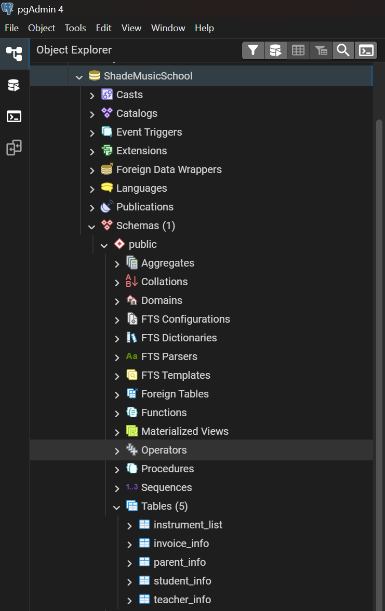

# Phase 1: Schema Design, Constraints, Input

## Business Scenario
The `Shade School of Music` is transitioning their data from an Excel sheet to a relational database model that utilizes PostgreSQL. Five tables will need to be created to transfer the data to the new model:
* Parent Info
* Student Info
* Teacher Info
* Invoices
* Instrument List

To store all of the tables that will be used, an initial database needs to be created. 

## Step-by-Step Implementation
### Step 1: Create Database and Tables
A database for the music school was created, titled `ShadeMusicSchool`. Inside the database, five tables were created to hold all relevant business data.


*Figure 1: The initial setup of the database and the tables needed for the music school.*

Next, **independent** tables were added. These tables were **Instrument List**, **Parent Info**, and **Teacher Info.** Constraints were added to these three tables to allow them to be related to the dependent tables that will be created next:
* **`GENERATED ALWAYS AS IDENTITY`**: Ensures that the **Instrument List** and **Teacher Info** tables have unique identifiers to appropriately relate data in the independent and dependent tables. 
* **`NOT NULL`**: Ensures that certain data, like the **Parent Info** email column, is entered and critical information is not missing.
* **`UNIQUE`**: Ensures that certain data, like the **Teacher Info** email column, is not duplicated and that there is no redundant data.
* **`PRIMARY KEY` / `FOREIGN KEY`**: Used to create the relations necessary for the dependent tables that will be created.

The next tables to be added are the **Invoice Info** and **Student Info** tables. These two tables are **dependent** and rely on the data in the **independent** tables. For example, the **Student Info** table has three `CONSTRAINTS` to appropriately relate the table to the **independent** tables:

```sql
CONSTRAINT student_info_parent_id_fkey FOREIGN KEY (parent_id) REFERENCES parent_info (id),
CONSTRAINT student_info_teacher_id_fkey FOREIGN KEY (teacher_id) REFERENCES teacher_info (id),
CONSTRAINT student_info_instrument_id_fkey FOREIGN KEY (instrument_id) REFERENCES instrument_list (id)
```

The complete database script can be found here: [01_schema.sql](./01_schema.sql)

### Step 2: Data Input
**Data Input Script:** [02_inputs.sql](./02_inputs.sql)


